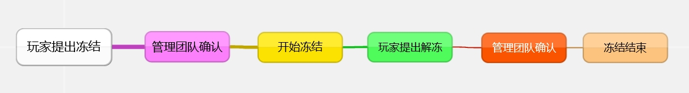
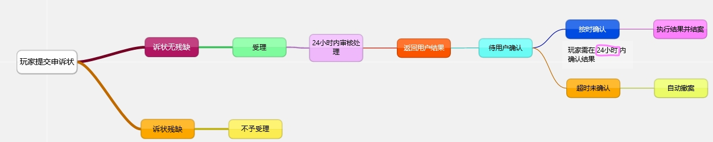

# 草原探险服务器账号冻结题外说明

## 冻结原因：
- 违规冻结(需申诉解冻)
- 玩家申请冻结(无需申诉解冻)


## 冻结流程


## 解冻状态：
临时冻结期满后自动解除，永久冻结需自行提交申诉状，每个账号仅有1次申诉机会，不论结果如何，都会在提交时扣除1次申诉机会。

## 申诉流程


**申诉结果返还用户后，需用户在24小时内确认，若超时未确认，则视为撤案，按原处罚决定书处理<br>**
**用户确认后，将按申诉结果处理。**

### 1.玩家提交
玩家可通过向官方团队发送电子邮件:[**mc@ypshidifu.cn**](mailto:mc@ypshidifu.cn)，提起申诉或在收到`处罚决定书`时当场提出申诉

### 2.管理团队审核
当管理团队收到玩家的申诉后，`将进行审核`，`根据事实依据`和`玩家提交的证据`综合判断并在1个工作日内审核完毕

### 3.玩家确认
当管理团队审核完毕后，`会将处理意见返还玩家`，玩家需再**1个自然工作日**确认，超时则视为撤诉，按原处罚决定书处理

### 4.执行结果
当玩家确认结果后，管理团队将按申诉结果执行

### 5.申诉完成
当管理团队执行完毕后，本案完结。

## 申诉状模板(通用版)
带`*`为必填项，**如为本人申请，则受托人&受托类型留空即可**。若申诉状不完整将不被受理。
```html
*申请人：[ ] //填写提示：自己的游戏昵称
*申请人联系方式: [ ] //填写提示：能正常接收邮件的邮箱即可(限QQ邮箱、163邮箱、微软邮箱，其余邮箱暂不支持)
*是否为本人申请？[ ] //填写提示：是/否
*受托人：[ ] //填写提示：受托人的游戏昵称，如果是本人申请，则留空
*受托类型：[ ] //填写提示：根据委托人授予的权限，填写完全委托/部分委托，如果是本人申请，则留空
*是否收到处罚决定书？[ ] //填写提示：是/否
*处罚决定书编号：[ ] //填写提示：处罚决定书编号，示例CYTX967525，如未收到处罚决定书，则留空。
处罚理由：[ ] //填写提示：处罚决定书中的处罚理由
*处罚决定：[ ] //填写提示：处罚决定书中的处罚决定

*申诉理由：[ ] //填写提示：你的申诉理由
证据：[ ] //填写提示：你的证据(仅支持在线提交图片证据，如有视听证据，请联系管理团队)
*申请时间：[ 年 月 日 时 分 ] 


```


---
## 临时/永久冻结申请书玩家自行申请模板
带`*`的未必填项，如为本人申请，则受托人&受托类型留空即可。

```html
游戏昵称：[玩家名]
*是否为本人申请？[是/否]
*受托人：[受托人名]
*受托类型：[完全委托/部分委托]

*申请理由：[理由]
*申请时间：[时间]
```
---
