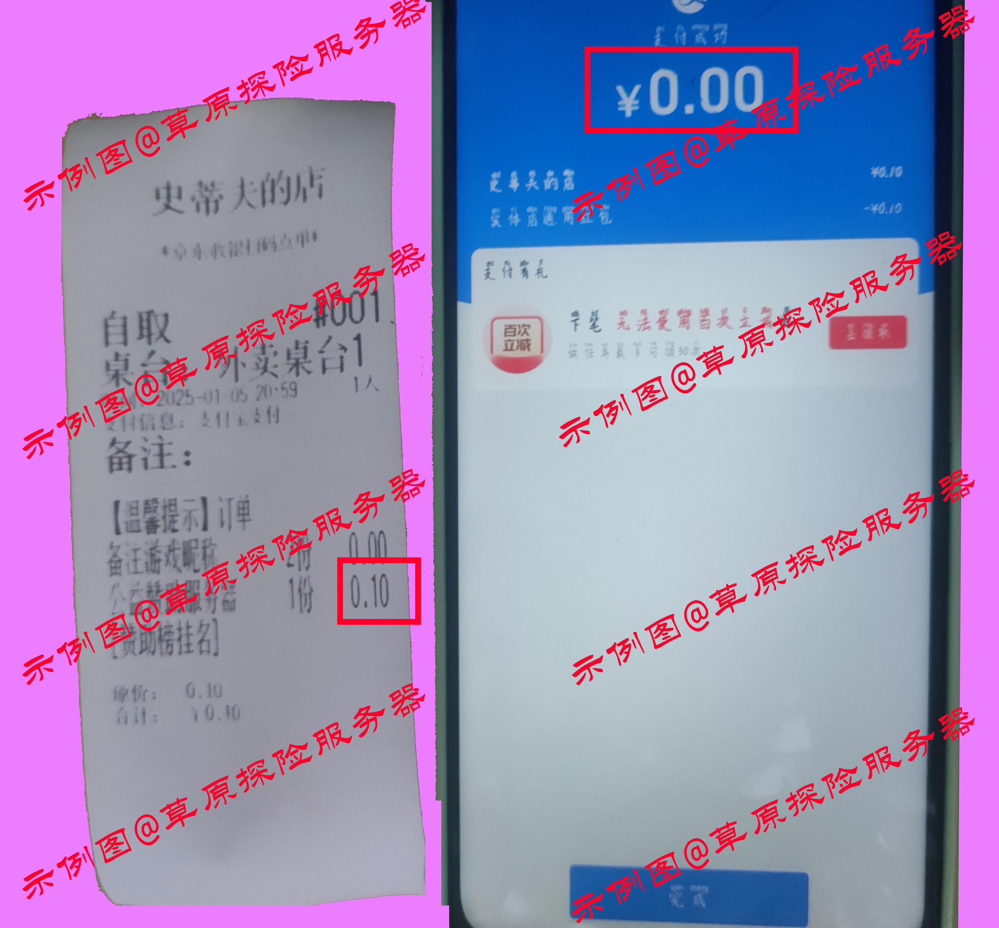

# 草原探险服务器玩家赞助公式列表

## 如何赞助？
- 赞助方式：扫码点单
- 赞助金额：0.1元起(平台设定的最低金额)
- 赞助二维码：
- 赞助后将取单号报给管理员，即可在下方赞助列表中，加上你的名字和对应的赞助记录
- 下单时，请在收货人姓名/地址栏输入你想要在下方列表中展示的名字即可，随意填写、到店自取视为匿名赞助

## 如何0元下单赞助/下单？
- 第1步，共5步： 注册一个[支付宝账号](https://memberprod.alipay.com/account/reg/index.htm)。如已有支付宝，则跳过该步骤
- 第2步，共5步： 下载并打开支付宝app，扫描赞助二维码中最右侧的红包二维码，领取消费红包。如已有支付宝则直接打开扫描红包二维码即可
- 第3步，共5步： 在红包界面选择扫一扫，并扫描赞助二维码中中间二维码进入小程序点单界面
- 第4步，共5步： 挑选商品加入购物车，并点击去结算，如若想达到0元下单，则需要挑选的商品金额等于红包金额
- 第5步，共5步： 选择外卖配送，并支付。如若商品总金额(含手续费)等于红包金额，则可0元支付如下图，若不满，则红包金额会抵扣一部分

- 情景示例： 张三同学领取红包后，`他的金额是0.5元`，他在本店想要赞助0.5元，`因其消费金额达到0.5元减0.5元手续费`的情况，再加上他的`红包金额0.5元`，所以他最终`实付金额是0元` 李四同学领取红包后，`他的红包金额是1元`，他挑选的`商品总价是1.5元`，因其消费金额`达到0.5元减免0.5手续费`的情况，`再加上其红包金额1元抵扣`，所以他的`实付金额是0.5元。`

## 赞助列表

| 玩家名字 | 赞助金额 | 日期 | 截图 |
| :----: | :----: | :----: | :----: |
| 山治 |  1 | 2025年1月2日 | 
| 风云 | 1 | 2025年1月2日 | 
| 山治 | 2 | 2024年12月7日 | 
| 风云 | 0.90 | 2025年1月10日 | ) |
| 虚位以待 | 0 | 虚位以待 | 虚位以待 |
